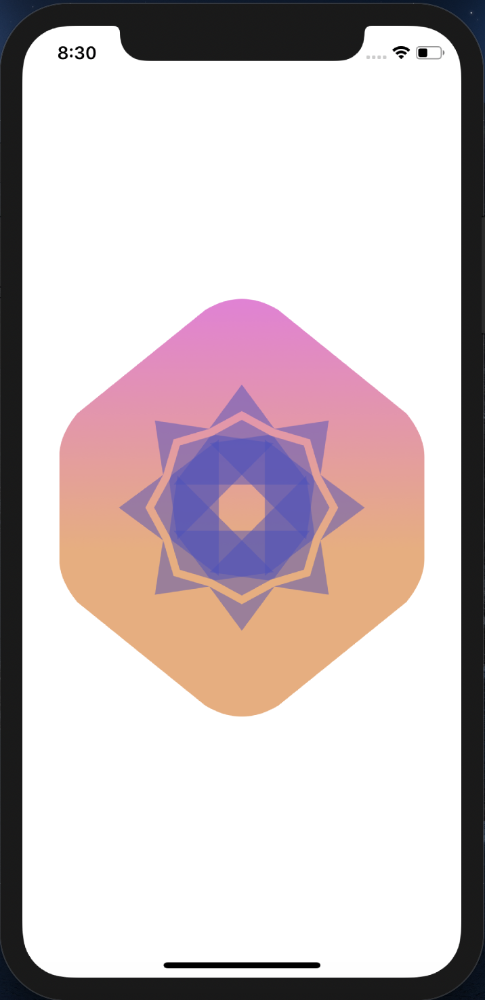
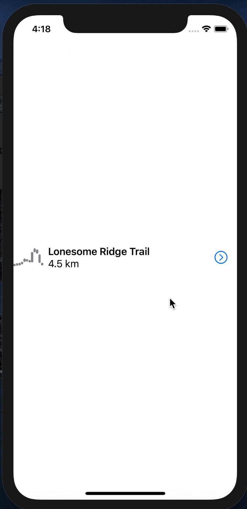
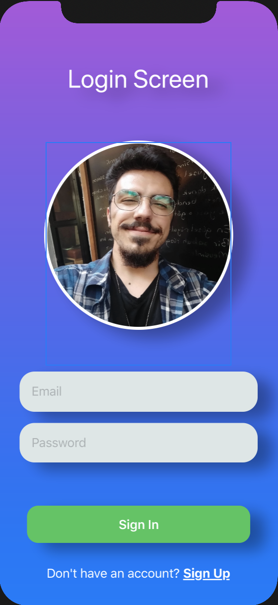
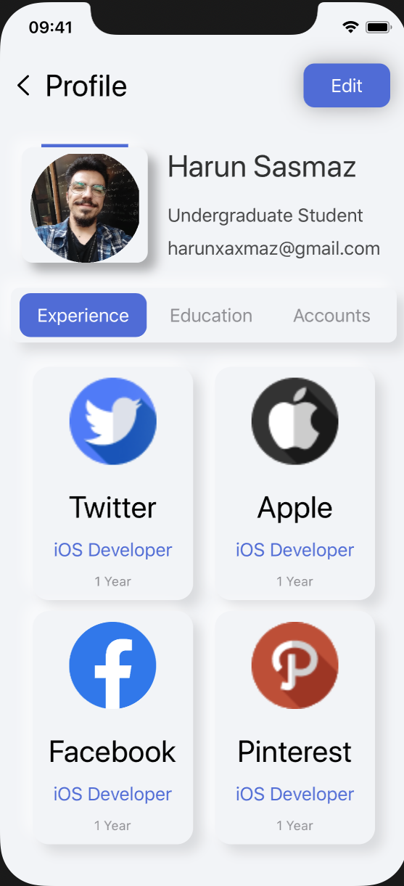
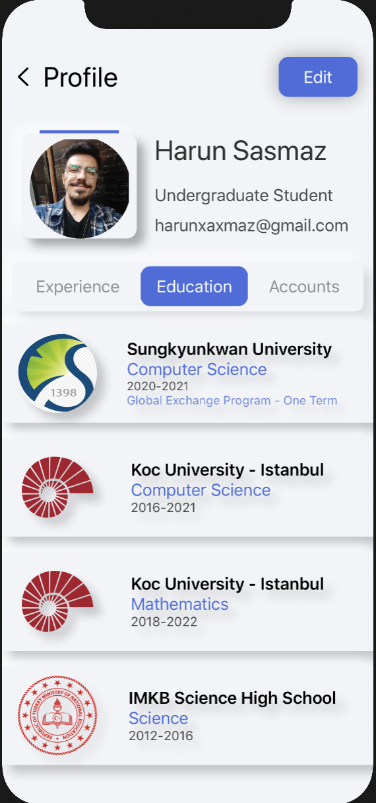

# iOS-practices

Simple iOS projects created after practice

Device:

> iPhone 11 Pro

XCode and Swift

> XCode 11 & Swift 5

## Table of Contents

- [Bull's Eye](#project-1-bulls-eye)
- [Landmark](#project-2-landmark)
- [Drawing and Animations](#project-3--drawing-and-animation)
- [Landmark Final](#project-4-landmark-final)
- [Login and Profile Views](#project-5-login-and-profile-views)

### Project 1: Bull's Eye

A type of "Hot and Cold" number guessing game in only landscape mode, created with SwiftUI

#### Game Screen

| Sliding | Hitting |
| ----- | --------|
|  |  |

#### About Page

### Project 2: Landmark

#### Landmark Listing

| All | Favorites Only |
| ----- | --------|
|  |  |

#### Single Landmark (Marking as favorite)

| Marking as Favorite | Listing After Marking |
| ----- | --------|
|  |  |

### Project 3:  Drawing and Animation

| Gradient Badge with Vector Drawing APIs | Graph Animations |
| ----- | --------|
|  |  |

### Project 4: #Project 2 + #Project 3 with Profile Page

### Project 5: Login and Profile Views

| Login Screen | Profile - Experience | Profile - Education
| ----- | -------- | -------- |
|  |  |  |

