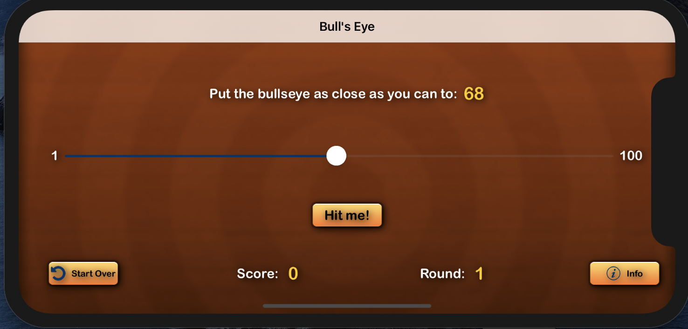
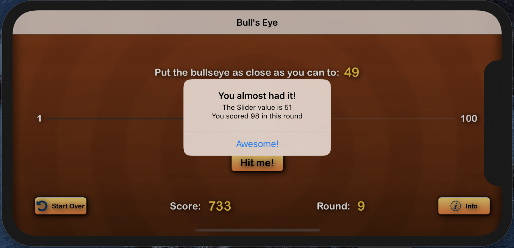
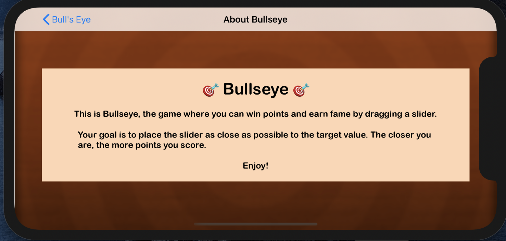
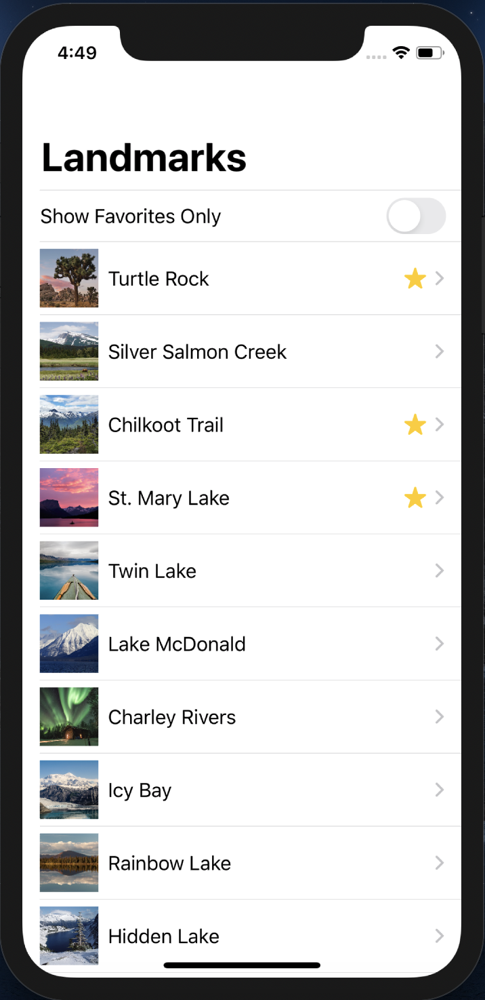
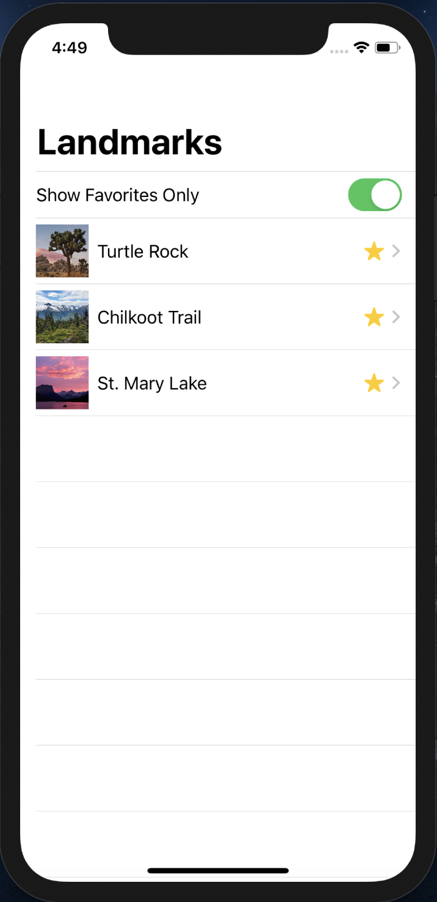
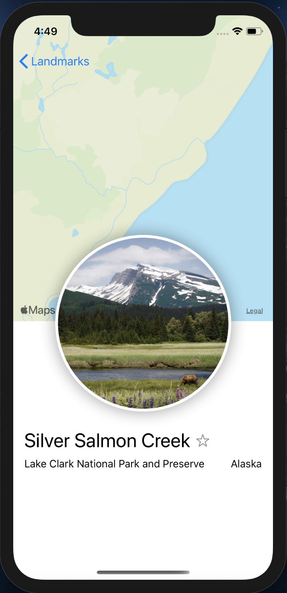
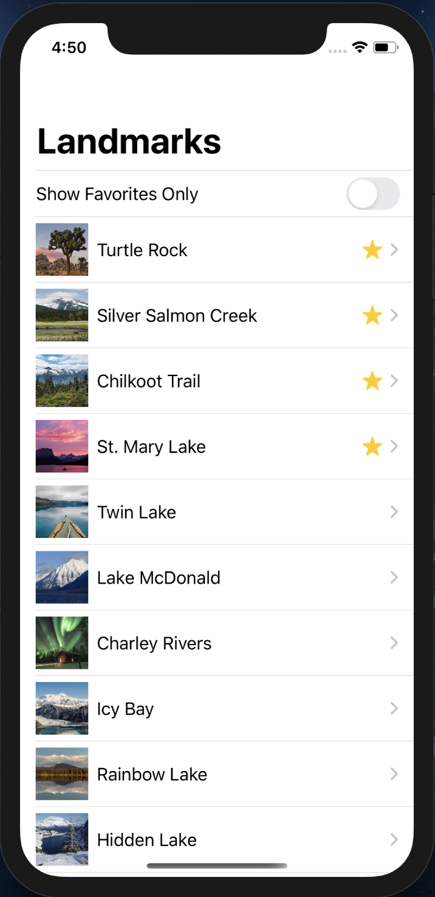

# iOS-practices

Simple iOS projects created after practice

Device:

> iPhone 11 Pro

XCode and Swift

> XCode 11 & Swift 5

## Project 1: Bull's Eye

A type of "Hot and Cold" number guessing game in only landscape mode, created with SwiftUI

### Game Screen

### Playing

### About Page

## Project 2: Landmark

### Landmark Listing (All)

### Landmark Listing (Favorites only)

### Single Landmark (Marking as favorite)

### Listing After Marking Favorite

